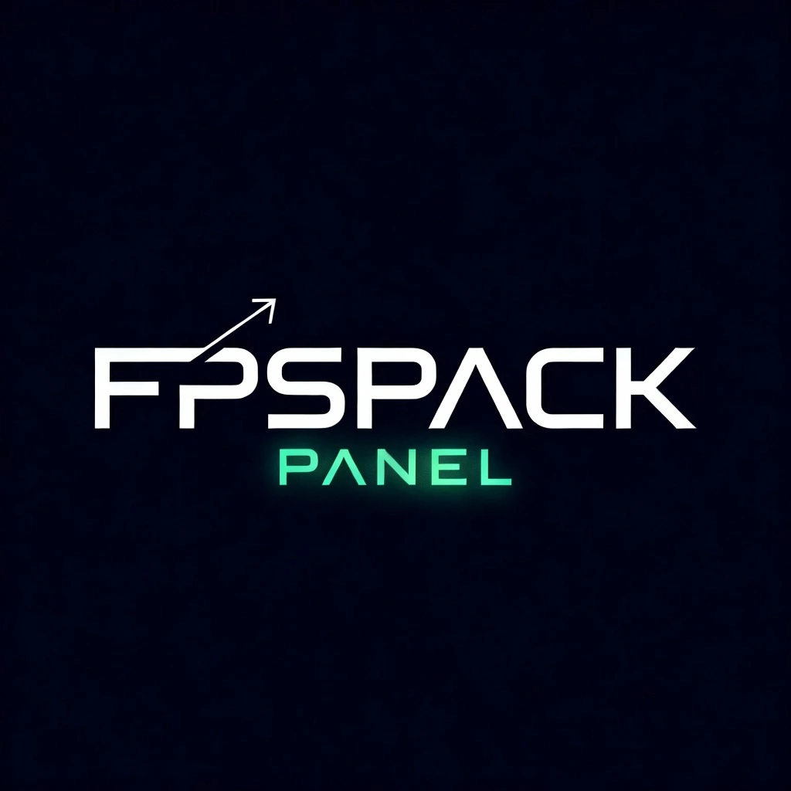

<div align="center">

<!-- Hero Banner (SVG) -->
<svg width="100%" height="120" viewBox="0 0 1200 120" xmlns="http://www.w3.org/2000/svg" role="img" aria-label="FPSPACK PANEL banner">
  <defs>
    <linearGradient id="g" x1="0" y1="0" x2="1" y2="0">
      <stop offset="0%" stop-color="#00D4FF"/>
      <stop offset="50%" stop-color="#7A5AF8"/>
      <stop offset="100%" stop-color="#FF3D81"/>
    </linearGradient>
  </defs>
  <rect width="1200" height="120" fill="url(#g)" rx="14"/>
  <text x="50%" y="54%" dominant-baseline="middle" text-anchor="middle"
        font-family="Segoe UI, Roboto, Helvetica, Arial" font-size="28" fill="#0D1117">FPSPACK PANEL</text>
  <text x="50%" y="82%" dominant-baseline="middle" text-anchor="middle"
        font-family="Segoe UI, Roboto, Helvetica, Arial" font-size="14" fill="#0D1117">Sistema de Otimização Avançado para Windows</text>
</svg>

<br/>

<!-- Badges -->


</div>

---

# FPSPACK PANEL

Aplicativo de otimização de desempenho para Windows com interface moderna em tema escuro, monitoramento em tempo real e recursos de limpeza e ajustes de sistema.

- Versão: `1.0.0`
- Autor: `aMathyzin`
- Empresa: `aMathyzin Studio`

## Preview

<div align="center">
  
</div>

## Recursos

- Dashboard com métricas de CPU, RAM e Disco em tempo real.
- Modo Turbo (`🚀`) para aplicar otimizações rápidas de alto impacto.
- Módulo de Otimização: tweaks de rede, registro e serviços.
- Módulo de Limpeza: cache, temporários e reciclagem segura.
- Configurações persistentes em `config/settings.json`.
- Tray icon e titlebar customizada sem moldura nativa.

## Tecnologias

- `PySide6` para UI (Qt for Python)
- `psutil`, `numpy`, `pandas` para coleta e processamento
- `pyqtgraph` e `matplotlib` para visualizações
- `colorlog` para logging
- Build com `Nuitka` (Windows)

## Instalação

- Pré-requisitos: `Python 3.13` (ou >= 3.10) e `pip`.
- Em Windows, abra um terminal na pasta do projeto e execute:

```bash
pip install -r requirements.txt
python main.py
```

Ou utilize o atalho:

```bash
run.bat
```

## Estrutura

- `core/` motores de otimização e limpeza, monitoramento e threads
- `ui/` janela principal, widgets e tema escuro
- `utils/` animações, config, logger e integração com sistema
- `config/settings.json` preferências do usuário
- `logs/` registros com rotação diária

## Como usar

- Abra o aplicativo e navegue pela sidebar:
  - `🏠 Dashboard`: visão geral e gráficos
  - `⚡ Otimização`: aplicar melhorias de desempenho
  - `🧹 Limpeza`: remover arquivos desnecessários com segurança
  - `⚙️ Configurações`: preferências e comportamento
  - `ℹ️ Sobre`: informações e créditos
- Ative o `🚀 MODO TURBO` para uma otimização rápida.

## Build (Nuitka)

> Dica: para distribuir o app em Windows, é recomendado empacotar com `Nuitka`.

Exemplo básico:

```bash
python -m nuitka --onefile --windows-disable-console --enable-plugin=pyqt6 --include-data-dir=img=img --output-dir=dist main.py
```

Ajuste plugins e includes conforme PySide6 e assets utilizados.

## Segurança / AV

Se algum antivírus reportar falso-positivo, adicione uma exceção e entre em contato: `contato@amathyzin.com.br`. Este binário é legítimo e construído com Python/Nuitka.

## Contribuição

- Issues e PRs são bem-vindos.
- Padronize mensagens e siga o estilo do código.
- Antes de enviar, valide em Windows e verifique `requirements.txt`.

## Créditos

- Design e desenvolvimento: `aMathyzin`
- Ícones e imagens: pasta `img/`

---

<details>
  <summary>Detalhes visuais (SVG)</summary>

  <!-- Divider Wave (SVG) -->
  <svg width="100%" height="60" viewBox="0 0 1200 60" xmlns="http://www.w3.org/2000/svg" aria-hidden="true">
    <path d="M0,20 C300,40 900,0 1200,20 L1200,60 L0,60 Z" fill="#0D1117" opacity="0.9"/>
    <path d="M0,30 C300,50 900,10 1200,30 L1200,60 L0,60 Z" fill="#00D4FF" opacity="0.35"/>
  </svg>
</details>